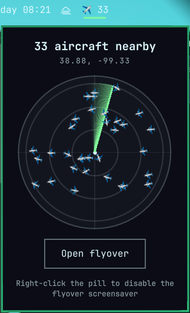

# flyover-pill



An Omarchy bar widget: an ambient "aircraft nearby" count for the bar.
Left-click opens a docked popup with its own live mini radar (range
rings, rotating sweep, nearby contacts) plus a button to launch the full
[flyover](https://github.com/linuxbren/flyover) scope in a terminal.
Right-click toggles flyover's screensaver on/off.

This widget is deliberately thin — it owns no *scope-drawing-in-a-
terminal* or screensaver-patching logic of its own (the popup's own mini
radar is a separate, simpler QML reimplementation, not a mirror of
flyover's terminal renderer). It polls [adsb.lol](https://adsb.lol) every
~20s for both the bar count and the popup radar's contacts (using the
same location flyover itself reads, from
`~/.local/state/omarchy/settings/weather.json`), launches the `flyover`
binary in a new terminal window when you click "Open flyover" in the
popup, and on right-click runs `omarchy branding screensaver text|reset`
— repurposed by flyover's own
[screensaver packaging](https://github.com/linuxbren/flyover/tree/master/packaging/screensaver)
to enable/disable it, which needs a one-time setup there first.

## Install

```
omarchy plugin add https://github.com/linuxbren/flyover-pill.git --enable
```

Requires [flyover](https://github.com/linuxbren/flyover) itself to be
installed. The widget checks `PATH` first, then falls back to
`~/.cargo/bin/flyover`, `/usr/bin/flyover`, and `/usr/local/bin/flyover`
— so `cargo install flyover`, an AUR install, or a manual `install` into
one of those all work without configuration. See
[INSTALL.md](INSTALL.md) if the pill shows `✈ !` or a click does nothing.

## Changelog

See [CHANGELOG.md](CHANGELOG.md).

## License

MIT — see [LICENSE](LICENSE).
